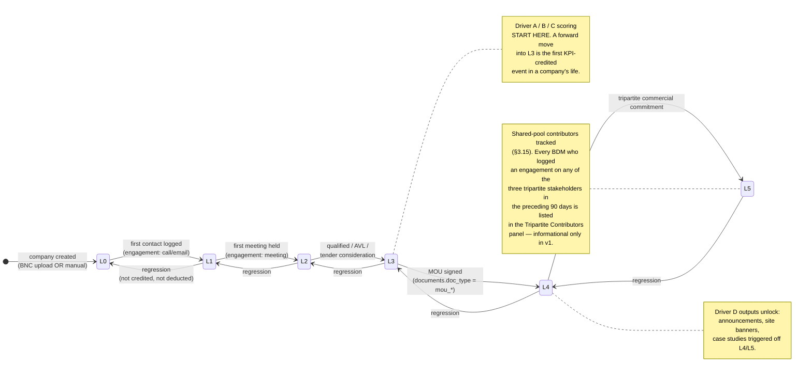
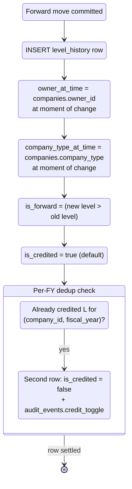

# §17.6 — Company L0→L5 Lifecycle & Credit Attribution

Covers the level transitions defined in the playbook and the non-negotiable
credit-attribution rules from prompt §3.3 and §3.9.

## State diagram

## Credit-attribution transitions (the ledger contract)

Every level transition — forward or backward — writes exactly one row into
`level_history`. The scoring engine only counts rows where
`is_forward = true AND is_credited = true`.

## Rules enforced in code

1. **Write path is exclusive.** `companies.current_level` has a BEFORE UPDATE
   trigger that rejects writes not made via the `change_company_level()`
   SECURITY DEFINER function. See migration `0021_functions_triggers.sql`.
2. **Snapshot at write time.** `owner_at_time` and `company_type_at_time` are
   read from `companies` inside the same transaction as the history row
   insert. This is what makes mid-year ownership transfers and type changes
   non-retroactive.
3. **Ownership-transfer rule.** When an admin force-reassigns ownership via
   `/admin/companies/reassign`, the default behaviour is "credit stays with
   prior owner" — no history row is modified. New forward moves after the
   transfer credit the new owner.
4. **Per-FY deduplication.** A company that moved L2→L3→L4 in Q1 contributes
   one L3 credit AND one L4 credit. A company that moved L3→L2→L3 in the same
   FY: the second L3 forward move gets `is_credited=false` automatically
   (rebuild logic in §5.1, "one credit per company per metric per fiscal year").
5. **Regression bookkeeping.** Regressions write `is_forward=false` rows for
   audit but never affect scoring, positively or negatively.
6. **Ecosystem points.** Fire on `is_forward=true AND is_credited=true` only —
   same gate, different ledger (`ecosystem_events`). Points are captured at
   the then-current `ecosystem_point_scale` value, not retroactively
   recomputed if the scale changes later.

## Evidence fields

`level_history.evidence_note` and `evidence_file_url` are optional but
encouraged for L3+. The `LevelChangeDialog` UI component surfaces them and
stores the file in the private `evidence/` bucket with a 15-minute signed URL
read model.

## Why this matters

Prompt §3.3 calls the ledger "non-negotiable." If the writes leak outside the
function, or the snapshots drift, the scoring engine becomes untrustworthy
and the entire KPI/BEI edifice collapses. The state diagrams above are the
visual contract enforced by the migrations in `0005_level_history.sql` and
`0021_functions_triggers.sql`.
